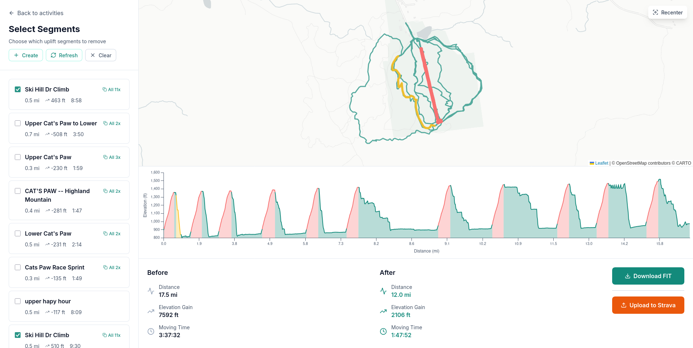

# Uplift Pruner

A tool to remove chairlift and shuttle segments from mountain bike activities to show accurate riding stats.

**Website**: https://uplift-pruner.rbritton.dev



## How It Works

1. Connect your Strava account
2. Select an activity
3. Choose which uplift segments to remove
4. Upload the cleaned activity back to Strava

## Development

```bash
npm install
npm run dev
```

## Environment Variables

- `PUBLIC_STRAVA_CLIENT_ID`
- `STRAVA_CLIENT_SECRET`
- `SESSION_SECRET`

## Deployment

Deploy to Cloudflare Pages:

- Build command: `npm run build`
- Output directory: `.svelte-kit/cloudflare`

## Tech Stack

SvelteKit, Cloudflare Pages, @garmin/fitsdk, Leaflet

## License

MIT
